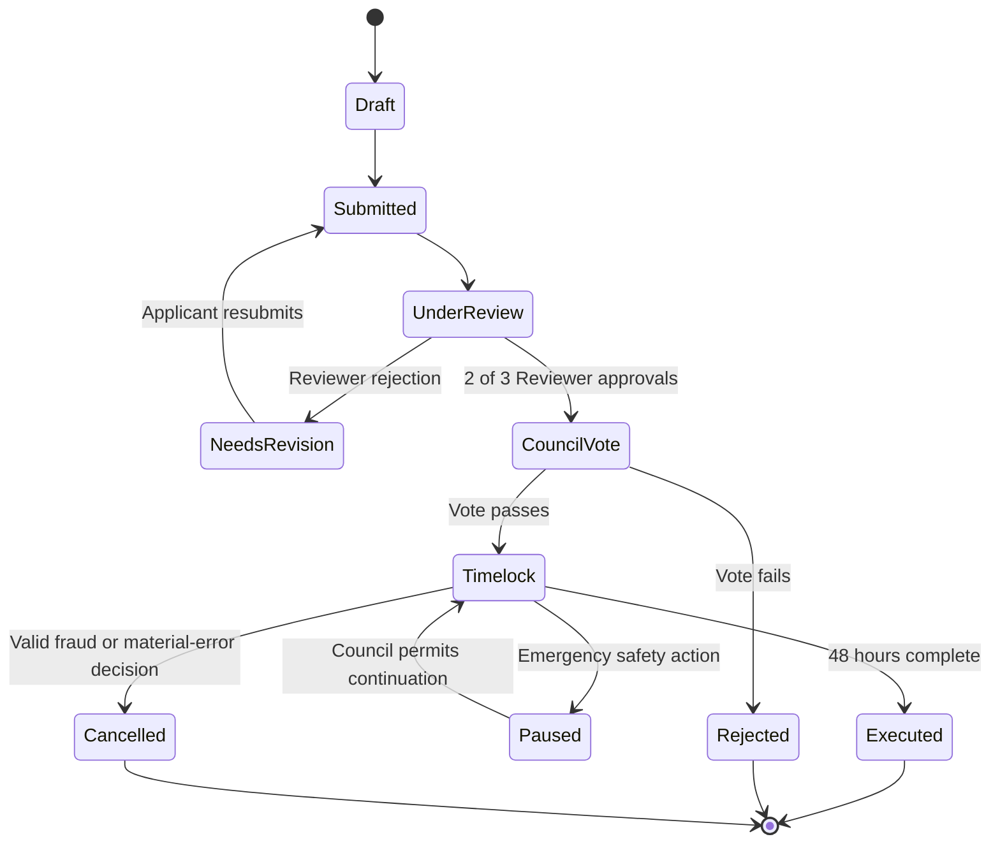
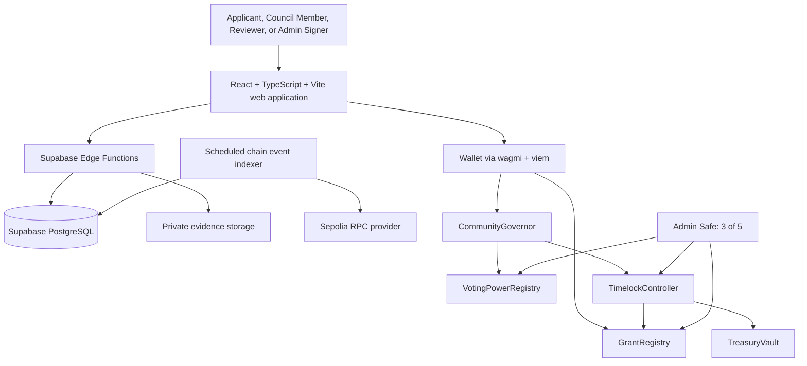

# Community Grant DAO — Functional Requirements

**Status:** Agreed product baseline  
**Purpose:** Define how the Community Grant DAO works before technical architecture and implementation are designed.

## 1. Product Overview

The Community Grant DAO is an open-domain community treasury. It funds real-world initiatives without limiting submissions to one subject such as technology, environment, or education.

Anyone can submit a funding request. Verified DAO members decide whether community funds should be spent. Elected Reviewers validate that proposals contain sufficient, genuine evidence before a funding vote begins.

The initial product is deliberately small:

- A grant has one recipient wallet and one payment amount.
- A successful grant results in one treasury transfer.
- Proposal evidence and review occur before the Council vote.
- There are no milestone payments, delegated voting, token trading, or automatic reputation algorithm in version 1.

### Product statement

> A community grant DAO where anyone can request funding for a real-world initiative, while verified members use capped, contribution-aware voting to decide whether a transparent community treasury should fund it.

## 2. Objectives

1. Let the public submit legitimate grant requests.
2. Prevent a single administrator, wealthy contributor, or fake-wallet group from controlling treasury decisions.
3. Give the community enough information to make a funding decision.
4. Keep the route from submission to payment easy to understand and audit.
5. Make each approved payment traceable to a proposal, review decision, Council vote, delay period, and on-chain transfer.

## 3. Scope

### Included in version 1

- Public grant submission
- Proposal categories used only for discovery and reporting
- Proposal evidence and Reviewer screening
- Verified Council membership and admission process
- Capped voting weight from 1 to 3
- Council funding votes with quorum
- Admin Multisig configuration management
- A 48-hour payment delay after approval
- One-time treasury transfers
- Transparent history of proposals, reviews, votes, configuration changes, and transfers

### Deferred from version 1

- Milestone-based funding and post-payment milestone reviews
- Token issuance, token markets, and token-based voting
- Delegated voting
- Category-specific Reviewer assignment
- Complex reputation scoring or prediction of vote quality
- Formal appeal court or arbitration system
- Automated recovery of funds after a completed transfer

## 4. Roles and Separation of Authority

| Role | Who can hold it | Main responsibility | Cannot do alone |
|---|---|---|---|
| Public Participant | Any wallet user | Submit a grant request and view public DAO activity | Vote, review, transfer funds, or change settings |
| Grant Applicant | A Public Participant who submits a proposal | Provide proposal details, recipient wallet, and evidence | Approve or vote on their own proposal |
| Eligible Council Member | A verified, admitted DAO member | Vote on grants, membership, Reviewer elections, and protected governance actions | Transfer treasury funds or change settings alone |
| Reviewer | An elected Eligible Council Member serving a fixed term | Check proposal completeness and evidence before Council voting | Approve treasury spending or review a conflicted proposal alone |
| Admin Multisig Signer | One of five independently selected DAO members | Apply approved changes, manage permitted configuration, and perform time-limited emergency safety actions | Approve a grant, admit/remove a member, or transfer treasury funds alone |
| Treasury | DAO-controlled account or contract | Holds funds and executes approved one-time payments | Make discretionary payments |

### Core principle

Reviewers verify whether a proposal is ready for the community to consider. Council Members decide whether money should be spent. The Admin Multisig operates safeguards and configuration. The treasury follows approved rules.

## 5. Launch and Decentralization Path

A DAO must begin with a small group that deploys the system. The launch process limits that initial power and makes it visible.

1. The DAO publishes this functional policy and its initial configuration.
2. Five independent people become the first Admin Multisig Signers.
3. A transparent founding cohort becomes the initial set of Eligible Council Members.
4. Each founding wallet and role is public in the DAO interface and on-chain records where applicable.
5. The Council can later elect, replace, or remove Admin Multisig Signers through protected governance.

The founding group has no permanent right to control the DAO. Its authority is limited by the same rules that apply later.

## 6. Membership Management

### 6.1 Membership levels

| Level | Eligibility | Rights |
|---|---|---|
| Public Participant | Connect a wallet and create a basic profile | Submit proposals and read public activity |
| Eligible Council Member | Complete verification and pass community admission | Vote and stand for Reviewer or Admin Signer roles |
| Reviewer | Be elected from Eligible Council Members | Participate in assigned evidence-review panels |

Creating a wallet profile does not create governance rights.

### 6.2 Admission as an Eligible Council Member

1. A Public Participant provides a wallet profile and completes basic identity and uniqueness verification.
2. The applicant obtains public endorsements from two Eligible Council Members.
3. The membership application becomes visible to the Council with its verification result and endorsements. Private identity documents are never made public.
4. Eligible Council Members vote using the normal simple-majority and 30% quorum rule.
5. If the vote passes, the Admin Multisig records the approved membership through the DAO's approved execution path.
6. The new member can participate only in votes that start after membership is active.

This process gives the community control over admission while requiring a basic defence against duplicate or fake identities.

### 6.3 Membership removal and emergency suspension

Removal has a higher threshold than admission because it can take away governance rights.

- A removal request must state the policy breach and supporting evidence.
- The member receives a reasonable opportunity to respond before voting closes.
- Removal requires at least two-thirds of votes cast in favour and the normal 30% quorum.
- After approval, the Admin Multisig executes the removal through the approved DAO path.
- The Admin Multisig cannot remove a member solely by its own decision.

For an immediate threat, such as a proven compromised wallet or credible fraud evidence, at least 3 of 5 Admin Signers may impose an emergency suspension for up to seven days. During suspension, the wallet cannot vote, review, or receive a new role. A Council decision is required to extend the restriction or make it permanent.

Membership changes never alter eligibility or voting weight for a vote that has already started. Each vote uses its own snapshot.

## 7. Admin Multisig

### 7.1 Composition

- The Admin Multisig has five Signers.
- Any protected Admin action requires at least 3 of 5 signatures.
- Signers should be independent people; no single person should control several signer wallets.
- A Signer remains an Eligible Council Member but receives no extra voting weight merely for being an Admin.

### 7.2 Duties

The Admin Multisig may:

- Apply future-facing configuration values, such as vote duration, quorum, timelock duration, contribution thresholds, and Reviewer term length.
- Record Council-approved membership changes.
- Publish configuration-change records.
- Trigger a limited emergency pause or suspension under the rules in this document.

### 7.3 Limits

The Admin Multisig may not:

- Approve, reject, amend, or pay a grant by itself.
- Admit or remove a Council Member without the required Council decision.
- Change the terms of a grant whose vote has already begun.
- Change the recipient wallet or amount of an approved grant.
- Give a Signer additional voting weight.

### 7.4 Signer changes

The Council elects, replaces, or removes Admin Signers through a protected governance decision requiring two-thirds approval and the normal quorum. The technical design must ensure that an outgoing Signer cannot block a valid Council-approved replacement.

## 8. Reviewer System

### 8.1 Election and term

- Any Eligible Council Member may apply or be nominated to become a Reviewer.
- Candidates publish a short profile describing relevant experience and conflicts of interest.
- The Council elects Reviewers using simple majority and the normal quorum.
- A Reviewer serves a six-month term. The term length is future-facing configuration managed by the Admin Multisig.
- The Council may remove a Reviewer before the term ends using the same two-thirds rule used for member removal.

### 8.2 Review panels

- Each submitted grant is assigned to three available Reviewers.
- Assignment should be random from the available Reviewer pool in version 1. The DAO does not attempt specialist matching.
- At least 2 of 3 Reviewers must approve the proposal before it proceeds to the Council.
- Every Reviewer records an approval or rejection reason.
- The public can see review outcomes and non-sensitive evidence references.

### 8.3 Conflicts of interest

A Reviewer must decline an assignment if they are the applicant, recipient, contributor to the proposal, a close associate of the applicant, or otherwise have a material personal interest in the outcome.

A conflicted Reviewer is replaced before the panel makes its decision. A Reviewer assigned to a grant does not vote on that grant as a Council Member. These rules prevent one person from influencing the same grant twice.

## 9. Voting Power

Every Eligible Council Member starts with one vote. A member can receive up to two additional points, so no member has more than three voting-weight points.

| Source | Weight | Intent |
|---|---:|---|
| Verified Council membership | 1 | Gives every admitted member a governance voice |
| Recognized community contribution | +1 | Rewards accepted Reviewer work or other recorded DAO contribution |
| Verified treasury contribution | +1 | Encourages support for the treasury without giving wealth unlimited power |
| Maximum | 3 | Keeps influence capped |

The detailed evidence needed for a contribution bonus is published as a future-facing configuration. A vote that matches the majority result does not earn voting weight; members must be free to vote honestly, including when they are in the minority.

Voting eligibility, each member's weight, and the quorum denominator are frozen when a vote starts. New memberships, removals, donations, and contribution changes affect only future votes.

## 10. Grant Proposal Requirements

### 10.1 Open submission

Any Public Participant may submit a grant proposal. The DAO accepts proposals from any lawful category. Categories help the community find and report on proposals; they do not limit eligibility.

To control spam while retaining open access, one wallet may have only one active proposal at a time. The platform may also apply basic off-chain rate limits.

### 10.2 Required proposal information

Each proposal must include:

- Clear title and plain-language summary
- Category
- Problem or purpose being addressed
- Requested amount
- Recipient wallet that will receive the payment
- Expected use of funds
- Applicant profile and relationship to the recipient, if different
- Supporting evidence, links, documents, or references
- Known risks and conflicts of interest

The applicant may revise and resubmit a proposal that fails Reviewer screening. Version 1 has no separate formal appeal process.

### 10.3 Evidence and privacy

Proposal summaries, requested amount, recipient wallet, review outcome, vote result, and payment record are public.

Identity records and sensitive supporting documents remain off-chain in protected storage. The public record may contain a reference, hash, or summary that proves which evidence set was reviewed without exposing private information.

## 11. Grant Lifecycle



### 11.1 Submission and review

1. An applicant creates and submits a proposal.
2. The proposal enters Reviewer screening.
3. A panel of three Reviewers checks completeness, credibility, evidence, recipient information, and declared conflicts.
4. Two approval decisions move it to a Council Vote.
5. A failed screen gives public reasons and moves the proposal to Needs Revision.

Reviewers assess whether the proposal is ready for governance; they do not decide whether treasury funds should be spent.

### 11.2 Council vote

1. The DAO creates a snapshot of eligible Council Members, voting weights, quorum denominator, vote duration, requested amount, recipient wallet, and timelock duration.
2. Council Members vote **For** or **Against** during the configured vote period. The initial default is seven calendar days.
3. At least 30% of the snapshot voting weight must participate.
4. The proposal passes when For weight is greater than Against weight.
5. A rejected vote closes the proposal with its result and cannot transfer funds.

The Admin Multisig can update the vote duration and quorum for proposals created later. It cannot alter a live vote or its snapshot.

### 11.3 Timelock and payment

1. A successful vote enters a mandatory 48-hour timelock.
2. During the timelock, the grant terms are fixed: recipient wallet, amount, vote outcome, and delay period.
3. When the timelock ends, the treasury executes one transfer of the exact approved amount to the approved recipient wallet.
4. The transfer transaction is recorded against the proposal and shown publicly.

The initial timelock is 48 hours. The Admin Multisig may change this setting for future proposals using 3 of 5 signatures.

### 11.4 Reports before payment

If credible fraud, a compromised recipient wallet, or a material error is reported before execution, the Admin Multisig may pause execution for up to seven days. The Council then decides whether to resume or cancel the grant.

Once a blockchain transfer completes, it cannot be automatically recalled. Version 1 therefore focuses its strongest verification and safety controls before payment.

## 12. Governance Actions Beyond Grants

The DAO uses the following action types.

| Action | Decision rule | Execution |
|---|---|---|
| Approve a grant | Simple majority and 30% quorum | Treasury after timelock |
| Admit a Council Member | Simple majority and 30% quorum | DAO-approved membership path |
| Elect a Reviewer | Simple majority and 30% quorum | Role becomes active for future assignments |
| Remove a Member or Reviewer | Two-thirds approval and 30% quorum | DAO-approved removal path |
| Add, remove, or replace Admin Signer | Two-thirds approval and 30% quorum | Protected governance execution |
| Emergency pause or short suspension | 3 of 5 Admin Signers, maximum seven days | Council review required for extension or cancellation |
| Update future configuration | 3 of 5 Admin Signers | Recorded change, effective only for future flows |

## 13. Configuration Rules

The Admin Multisig manages configuration only through 3 of 5 signatures. Every change must be visible in a configuration history.

Configurable values include:

- Vote duration
- Quorum percentage
- Timelock duration
- Contributor-bonus evidence and threshold
- Reviewer term length
- Proposal rate-limit settings
- Basic verification provider or process

Configuration changes are never retroactive. A grant, membership vote, or role election keeps the values that existed when its vote started.

## 14. Transparency and Audit Requirements

The product must make the following information available in a readable public history:

- Proposal details and status changes
- Reviewer assignments, decisions, and stated reasons
- Conflict-of-interest declarations
- Council vote outcomes, quorum outcome, and snapshot time
- Approved recipient wallet and exact amount
- Timelock start and completion time
- Treasury payment transaction
- Member and role changes
- Admin Multisig configuration changes and signatures
- Emergency pause or suspension reason and outcome

Sensitive personal documents are excluded from the public record.

## 15. Functional Rules and Acceptance Criteria

1. A public wallet can submit one active grant request without becoming a Council Member.
2. A proposal cannot reach the Council Vote state until at least 2 of its 3 Reviewers approve it.
3. A Reviewer cannot review or vote on a proposal in which they have a material conflict.
4. A grant cannot pass without 30% of its snapshot voting weight participating and For weight exceeding Against weight.
5. No wallet has voting weight above 3.
6. New members and changed voting weights cannot affect an ongoing vote.
7. A passed grant cannot transfer funds until its 48-hour timelock has completed.
8. The treasury can transfer only the approved amount to the approved recipient wallet.
9. A single Admin Signer cannot perform a protected administrative action.
10. The Admin Multisig cannot unilaterally admit or remove an Eligible Council Member.
11. Every completed transfer is linked to its proposal, review outcome, vote result, and timelock record.
12. Private identity documents are not stored in the public blockchain record.

## 16. Decisions Reserved for Technical Design

This document defines product behaviour. The technical requirements document will decide how to implement it, including:

- Blockchain network and testnet choice
- Smart-contract composition, governance framework, and multisig integration
- Snapshot and capped voting-weight implementation
- Wallet connection and identity-verification integration
- Off-chain database, document storage, indexing, and audit-log design
- Reviewer assignment implementation
- Frontend pages, API boundaries, and background services
- Testing, security review, monitoring, and deployment process

---

# Technical Requirements and Architecture

**Status:** Proposed implementation baseline for review
**Design goal:** Ship a credible, secure testnet DAO without adding infrastructure that the project does not need.

## 17. Architecture Principles

1. **Blockchain decides authority and money.** Eligibility, voting snapshots, vote outcomes, review approval counts, timelocks, role changes, and treasury transfers must be enforced by smart contracts.
2. **The application makes the DAO usable.** The web application and database help people submit proposals, store private evidence, search history, and read fast dashboards. They must never be the authority that releases funds or changes a vote outcome.
3. **Use established contracts for standard governance.** The project will build on OpenZeppelin Governor and Timelock modules rather than recreating core vote counting and delayed execution.
4. **Keep voting power internal and non-transferable.** The DAO will not issue a tradable governance token. Its voting-power registry only records a verified member's weight from 1 to 3.
5. **Every important decision has an immutable snapshot.** A live vote keeps its membership, voting weights, quorum, vote duration, and proposal terms even if configuration changes later.
6. **The first release runs only on testnet.** No real-value mainnet treasury is in scope.

## 18. Selected Technology Stack

| Area | Selected technology | Why this is suitable for this project |
|---|---|---|
| Web application | React, TypeScript, Vite | React satisfies the project requirement; Vite provides a fast, small React application without introducing Next.js or server-rendering complexity. |
| UI and client state | Tailwind CSS, shadcn/ui, React Router, TanStack Query | Gives consistent accessible UI, client routing, and reliable server/cache state with a small learning curve. |
| Forms and validation | React Hook Form and Zod | Validates grant forms before upload and uses the same schema concepts at the API boundary. |
| Wallet connection | wagmi and viem | React-friendly wallet state and type-safe EVM contract reads, writes, and event decoding. |
| Smart contracts | Solidity, Foundry, OpenZeppelin Contracts | Foundry gives fast Solidity testing and deployment scripts; OpenZeppelin provides maintained governance, timelock, access-control, and security primitives. |
| Governance custody | OpenZeppelin `Governor` and `TimelockController`; Safe 3-of-5 multisig | Separates Council voting, delayed execution, and protected administrator operations. |
| Backend services | Supabase Edge Functions, TypeScript | Avoids a separate always-running Node server for version 1 while keeping privileged operations off the browser. |
| Database | Supabase PostgreSQL | Managed relational data, migrations, backups, Row Level Security, and a natural fit for proposal and review records. |
| Private evidence storage | Supabase Storage private bucket | Stores sensitive documents outside the blockchain with signed, time-limited access. |
| Chain and currency | Ethereum Sepolia and test ETH | Widely supported test network, familiar wallet tooling, and no real-value treasury in the first release. |
| RPC access | Managed Sepolia RPC provider behind a provider adapter | Reliable reads and log polling without coupling the application to a single provider. |
| Hosting | Vercel static deployment for the React application; Supabase for data and functions | Low operational overhead and independent deploys for web and backend. |
| Monitoring | Sentry for browser and Edge Function errors; database event-indexer health record | Detects user-facing failures and stale chain indexing early. |
| CI | GitHub Actions | Runs formatting, unit tests, contract tests, static analysis, and production builds on every pull request. |

The selected components are deliberately conventional. The project should demonstrate correct use of each component rather than create custom alternatives for routine problems.

## 19. High-Level Architecture



### Trust boundaries

- The **wallet** signs the user's on-chain vote, proposal, or review transaction.
- The **smart contracts** enforce the authoritative business rules.
- The **database** is a read model and workflow store. It never determines whether money can move.
- The **Edge Functions** validate signed requests, store permitted off-chain data, issue private upload/download URLs, and index blockchain events.
- The **Admin Safe** can make only the specific protected configuration and emergency calls granted to it by contracts.

## 20. Smart Contract Design

The contract system uses OpenZeppelin's Governor foundation. OpenZeppelin documents `GovernorVotes` for snapshot-based voting power and `GovernorTimelockControl` with `TimelockController` for delayed execution. [OpenZeppelin governance documentation](https://docs.openzeppelin.com/contracts/5.x/governance)

### 20.1 Contract responsibilities

| Contract | Responsibility | Privileged caller(s) |
|---|---|---|
| `VotingPowerRegistry` | Stores active membership, Reviewer status, and the non-transferable voting weight from 1 to 3. Provides historical vote checkpoints to the Governor. | Timelock for Council-approved role changes; Admin Safe only for tightly scoped, future-facing policy configuration |
| `GrantRegistry` | Stores the on-chain identity of each grant: applicant, recipient wallet, requested amount, evidence reference hash, Reviewer decisions, and lifecycle status. | Reviewers submit their own review; Timelock applies approved lifecycle transitions |
| `CommunityGovernor` | Creates, tracks, and counts Council governance proposals. Uses historical voting power and snapshot quorum. | Public proposal creation subject to the configured threshold; no operator can alter a cast vote |
| `TimelockController` | Queues successful Governor actions and enforces the payment delay. | Governor schedules; anyone may execute a ready, valid operation |
| `TreasuryVault` | Holds test ETH and releases the exact amount to an approved recipient only through a valid timelocked action. Can be paused. | Timelock for payment; Admin Safe for a limited pause only |
| `DAOConfig` | Holds versioned, bounded future configuration values. | Admin Safe with 3 of 5 signatures |

### 20.2 Voting-power implementation

`VotingPowerRegistry` is a custom non-transferable implementation of OpenZeppelin's `IVotes` interface. It is an internal accounting registry, not an ERC-20 or a user-traded token.

- An active Council Member has base weight `1`.
- The registry can add one verified community-contribution point and one verified treasury-contribution point.
- Contract validation prevents a weight below `0` or above `3`.
- Transfers, delegation, approvals, and trading are not implemented.
- The registry checkpoints both each wallet's weight and the total eligible voting weight by block number.
- `CommunityGovernor` reads the checkpoint at the vote snapshot, so changes after voting begins cannot affect that vote.

This preserves the agreed 1-to-3 model without pretending that internal voting weight is a financial asset.

### 20.3 Governance proposal types

The same Governor handles the action types below. Each proposal contains the exact target contract call that will execute if the vote passes.

| Proposal type | Timelocked action |
|---|---|
| Grant approval | `GrantRegistry` marks the reviewed grant approved and `TreasuryVault` sends the exact approved test ETH amount |
| Member admission | `VotingPowerRegistry` activates the admitted wallet at base weight 1 |
| Member or Reviewer removal | `VotingPowerRegistry` deactivates the role or membership |
| Reviewer election | `VotingPowerRegistry` grants Reviewer status with its term end time |
| Admin Signer replacement | A controlled Safe-owner change transaction is prepared and executed only after the protected governance path succeeds |

An Eligible Council Member sponsors an on-chain proposal. For a public grant, the sponsoring member must be one of the Reviewers who approved the grant or another Council Member acting from the completed public review record. The Governor accepts a grant action only when the `GrantRegistry` proves that the required 2-of-3 review approval exists.

### 20.4 Vote and configuration snapshots

OpenZeppelin Governor already snapshots voting power. This project adds a small custom configuration-snapshot extension because the functional rules require Admin configuration to affect future proposals only.

When a proposal is created, `CommunityGovernor` stores:

- Voting-power snapshot block
- Total-weight quorum denominator
- Quorum percentage
- Vote start and deadline
- Configuration version identifier
- For grants: recipient wallet, exact amount, grant identifier, and review approval state

`DAOConfig` changes the active configuration only for later proposals. It cannot rewrite an existing proposal's stored values.

### 20.5 Timelock and treasury protection

- The contract minimum delay is **48 hours** in version 1.
- A successful grant is queued through `TimelockController`; it becomes executable only after its recorded delay has elapsed.
- Any wallet may execute a ready timelocked operation. This prevents an unavailable admin from blocking a valid approved payment.
- `TreasuryVault` accepts a payment only from the Timelock and only for an approved, unexecuted grant.
- The vault records a grant as executed before the external ETH transfer, uses reentrancy protection, and rejects a duplicate payment.
- The Admin Safe can pause the vault for at most seven days. It cannot transfer funds or create a payment.

The Admin Safe may configure future policy values through `DAOConfig`, but it cannot reduce the contract-enforced minimum payment delay below 48 hours. This is an intentional safety floor.

### 20.6 Admin Safe integration

Deploy one [Safe Smart Account](https://docs.safe.global/advanced/smart-account-overview) with five independent owners and a threshold of three confirmations.

- The Safe is the holder of narrowly scoped administrator roles.
- The Safe Transaction Service is used for the Signers to propose and collect approvals for configuration or emergency actions.
- Safe does not own the treasury and cannot call arbitrary treasury transfers.
- Contract roles grant the Safe only `CONFIG_MANAGER_ROLE` and `EMERGENCY_PAUSER_ROLE` as needed.
- Council-approved membership and role changes are executed through the Governor and Timelock, not as discretionary Safe calls.

This contract-enforced division is stronger than asking Signers to manually respect a policy.

### 20.7 On-chain data limits

Contracts store only data needed for authority and audit:

- Wallet addresses, role status, voting checkpoints, and role term end
- Grant identifier, recipient wallet, requested amount, lifecycle state, and evidence hash/reference
- Reviewer decisions and non-sensitive reason hash/reference
- Proposal identifiers, vote results, snapshot data, and execution state

Long descriptions, files, identity documents, and private evidence stay off-chain. The contract stores a content hash or immutable reference so the reviewed version can be verified later.

## 21. Web Application Design

### 21.1 Application pages

| Route | User need |
|---|---|
| `/` | DAO purpose, treasury balance, current activity, and clear call to submit or participate |
| `/grants` | Search, filter, and browse grants by status and category |
| `/grants/new` | Guided public proposal form with evidence upload |
| `/grants/:id` | Full proposal, public evidence references, Reviewer outcome, vote details, timelock, and transfer record |
| `/governance` | Active and past Council proposals, vote deadlines, quorum progress, and vote action |
| `/membership` | Member application, endorsements, application status, and member directory |
| `/reviewer` | Reviewer applications, assigned review queue, conflict declaration, and review decision form |
| `/admin` | Safe transaction links, current configuration, configuration history, emergency-pause status, and restricted admin actions |
| `/activity` | Event timeline built from indexed on-chain events |

### 21.2 Frontend responsibilities

- Connect the user's wallet and verify the Sepolia network.
- Read authoritative contract state using wagmi and viem.
- Submit transactions directly from the user's wallet; the browser never handles private keys.
- Use the backend for private uploads, readable search, server-verified signed requests, and indexed history.
- Show transaction state clearly: wallet signature requested, transaction submitted, pending confirmation, confirmed, or failed.
- Link every transaction to a block explorer.
- Fall back to direct contract reads if the indexed database is behind.

### 21.3 Client-side quality rules

- TypeScript strict mode is enabled.
- Contract addresses and ABI versions are generated from deployment artifacts rather than copied by hand.
- Forms use Zod validation before submission and API validation repeats it on the server.
- The UI never calculates an authoritative quorum, eligibility result, or execution permission by itself; it displays contract reads.
- Accessibility includes semantic form labels, keyboard navigation, visible transaction status, and readable error messages.

## 22. Backend and Service Design

Supabase Edge Functions provide the small server-side boundary needed by version 1. They are not a substitute for the contracts; they handle data that should not be public or trusted to a browser.

### 22.1 Edge Functions

| Function | Responsibility |
|---|---|
| `auth-challenge` | Creates a one-time, short-lived wallet-signature nonce. |
| `auth-verify` | Verifies the signed wallet login message, consumes the nonce, and creates a short-lived application session. |
| `proposal-draft` | Validates and persists off-chain proposal text and metadata before the applicant submits the matching on-chain grant transaction. |
| `evidence-upload-url` | Verifies the applicant or assigned Reviewer and returns a short-lived signed upload URL for a private file. |
| `evidence-download-url` | Authorizes a Reviewer, applicant, or permitted admin workflow and returns a short-lived signed download URL. |
| `chain-indexer` | Runs on a schedule, fetches finalized contract logs, deduplicates them, updates read models, and records its sync cursor. |
| `safe-transaction-link` | Creates safe, validated links or metadata for a permitted Safe configuration action; it does not sign or execute it. |

### 22.2 Authentication and authorization

- The application uses wallet-signature login based on a nonce, domain, chain ID, issued time, expiry time, and statement of intent.
- A nonce is single-use and expires quickly, preventing replay.
- The backend resolves roles from indexed on-chain state. It never trusts a browser-supplied role claim.
- Sensitive actions require both an authenticated wallet session and the relevant on-chain role.
- Direct public writes to database tables are disabled. Edge Functions perform validated writes with server credentials.

### 22.3 Chain event indexing

Blockchain events are the source of truth, while PostgreSQL is a searchable projection.

The scheduled indexer:

1. Reads events only after a configurable finality buffer.
2. Stores a durable block cursor.
3. Inserts raw events idempotently using the tuple `(chain_id, transaction_hash, log_index)` as the unique key.
4. Updates normalized proposal, membership, vote, and treasury read models in the same database transaction.
5. Rewinds and rebuilds the unfinalized range if a block-hash mismatch indicates a chain reorganization.
6. Records last processed block, last successful run, and lag so the dashboard can report stale data.

The frontend can read the relevant contract directly when an indexed record is missing or stale.

## 23. Database and Storage Design

### 23.1 PostgreSQL is used for off-chain workflow data

PostgreSQL is appropriate because the system contains related entities, status transitions, audit records, and permission-sensitive documents. It also supports clear migrations and indexes for the common query patterns.

| Table / read model | Primary purpose |
|---|---|
| `wallet_profiles` | Public profile data keyed by normalized wallet address |
| `wallet_login_nonces` | Single-use authentication nonces with expiry and consumption time |
| `grant_drafts` | Editable off-chain proposal content before or alongside on-chain submission |
| `grant_documents` | Private or public file metadata, content hash, storage key, and visibility |
| `membership_applications` | Identity verification outcome, endorsements, and application status; no raw identity document |
| `review_assignments` | Off-chain workflow view of the three assigned Reviewers and conflict status |
| `chain_events` | Immutable indexed contract-event ledger |
| `grant_read_models` | Query-friendly grant state projected from events |
| `governance_read_models` | Query-friendly proposal and vote state projected from events |
| `configuration_history` | Indexed configuration versions and Safe transaction references |
| `indexer_state` | Finalized cursor, block hash, lag, and last successful run |
| `audit_log` | Backend workflow actions such as signed-URL issuance and administrative request creation |

### 23.2 Database rules

- Use UUID primary keys for off-chain records and `chain_id + contract_address + on_chain_id` unique keys for blockchain entities.
- Store money as integer base units or numeric strings; never JavaScript floating-point numbers.
- Store wallet addresses normalized to lowercase for lookup while preserving checksum format for display.
- Add indexes for grant status and creation time, reviewer assignment and status, proposal snapshot block, event block number, and document ownership.
- Use foreign keys for relationships that exist entirely off-chain. Never assume a database row proves an on-chain action.
- Use append-only events and audit records for traceability; read models may be rebuilt from those events.

### 23.3 Row Level Security and storage access

Every exposed table has Row Level Security enabled. Browser clients receive only public, read-only data where direct reads are necessary. Private evidence, membership verification results, and administrative workflow records remain server-mediated.

- The Supabase service-role key exists only in Edge Function secrets.
- Private evidence uses a non-public storage bucket.
- Upload and download access uses short-lived signed URLs after a server-side role and ownership check.
- Sensitive files are malware-scanned before review access is granted.
- Public descriptions may be exposed, but identity documents must never be placed in a public bucket or contract event.

These rules follow Supabase's guidance to enable RLS on exposed tables and to keep service-role credentials out of client applications. [Supabase security guidance](https://supabase.com/docs/guides/security/product-security)

## 24. Data Ownership and Source of Truth

| Data | Source of truth | Database role |
|---|---|---|
| Member status, Reviewer status, voting weight | `VotingPowerRegistry` | Indexed display and query cache |
| Vote snapshot, cast votes, quorum, outcome | `CommunityGovernor` | Indexed display and analytics |
| Review approval count and grant execution status | `GrantRegistry` and `TreasuryVault` | Indexed display and work queue |
| Treasury balance and transfer | Sepolia chain and `TreasuryVault` | Cached dashboard value and transaction link |
| Proposal description and documents | PostgreSQL and Storage, hash anchored on-chain | Workflow source; contract reference proves reviewed version |
| Private identity documents | Private Storage only | Access metadata and verification outcome only |
| Admin Safe confirmations | Safe and Safe Transaction Service | Read-only link and status projection |

## 25. Security Design

### 25.1 Contract security controls

- Use current OpenZeppelin contracts for `Governor`, `TimelockController`, `AccessControl`, `Pausable`, and `ReentrancyGuard`.
- Apply least-privilege roles; no deployer wallet remains a permanent privileged owner.
- Put treasury custody behind the Timelock, with no external method for arbitrary ETH transfer.
- Validate every recipient address, amount, status transition, Reviewer assignment, 2-of-3 review condition, and one-time grant execution.
- Store configuration versions and proposal snapshots so a future setting cannot rewrite a live decision.
- Prefer direct calls to audited contracts. Do not add Safe modules in version 1 because modules create a separate critical-security surface.
- Verify all contracts on the Sepolia block explorer after deployment.

### 25.2 Application security controls

- Validate all request bodies with Zod on the server.
- Rate-limit public submission, nonce, and signed-URL endpoints.
- Use Content Security Policy, HTTPS, secure headers, and a restrictive CORS allow-list.
- Never expose RPC, Supabase service-role, Safe API, or monitoring secrets to the browser.
- Sanitize rich text and render submitted links safely.
- Log administrative attempts, evidence access, and failed authorization checks without logging sensitive document content.

### 25.3 Operational safeguards

- Use separate local, testnet, and production-like environment variables.
- Store deployer and Safe signer keys only in wallets or a protected secret manager, never in the repository.
- Set spending and testnet funding limits for the first deployment.
- Keep a written emergency runbook: pause reason, maximum seven-day duration, Council review, and unpause/cancel process.

## 26. Repository Structure

Use a small pnpm workspace monorepo so contracts and web application share typed deployment data without forcing a large microservice setup.

```text
community_treasury_DAO/
├── apps/
│   └── web/                 # React + Vite client
├── contracts/
│   ├── src/                 # Solidity contracts
│   ├── test/                # Foundry unit, fuzz, and invariant tests
│   ├── script/              # Deploy and role-configuration scripts
│   └── deployments/         # Chain-specific addresses and ABI exports
├── supabase/
│   ├── functions/           # Edge Functions
│   ├── migrations/          # PostgreSQL migrations
│   └── seed.sql             # Local development seed data only
├── packages/
│   ├── contract-client/     # Generated ABIs, addresses, and typed helpers
│   └── shared-schemas/      # Zod schemas shared by web and functions
├── docs/
├── .github/workflows/
└── pnpm-workspace.yaml
```

## 27. Environments and Deployment

| Environment | Purpose | Chain | Data |
|---|---|---|---|
| Local | Fast development and automated tests | Anvil | Local PostgreSQL/Storage emulator or isolated Supabase project |
| Testnet | Demonstrable end-to-end DAO | Sepolia | Dedicated Supabase project and test files |
| Production | Deferred until a separate security review | No real-value deployment in version 1 | Separate accounts, keys, and backups |

### Deployment order

1. Deploy and test `VotingPowerRegistry`, `DAOConfig`, `GrantRegistry`, `TreasuryVault`, Timelock, and Governor locally.
2. Deploy the Safe with five owner wallets and 3-of-5 threshold.
3. Grant the narrow contract roles, transfer contract administration to the intended Timelock/Safe owners, and revoke deployer privileges.
4. Export addresses and ABIs to `packages/contract-client`.
5. Deploy database migrations, storage policies, and Edge Functions.
6. Configure the event indexer with contract addresses and a finalized start block.
7. Deploy the React application with its public chain, contract-address, Supabase URL, and RPC configuration.
8. Run the end-to-end acceptance flow on Sepolia before sharing the application.

## 28. Testing and Quality Gates

### Smart contract tests

- Unit tests for each lifecycle transition and role boundary.
- Fuzz tests for voting weight updates, membership changes, proposal amounts, and duplicate execution attempts.
- Invariant tests proving that voting weight never exceeds 3, a grant transfers at most once, and no payment occurs before the timelock.
- Integration tests for Reviewer approval, Governor vote, Timelock queue, and treasury execution.
- Static analysis with Slither and compiler warnings treated as failures.

### Backend and database tests

- Test Edge Functions for nonce replay, unauthorized uploads, expired signed URLs, role checks, and malformed inputs.
- Run migrations in an isolated database during CI.
- Test event idempotency, finalized-log processing, and read-model rebuild from raw events.
- Verify RLS policies with allowed and denied database-client scenarios.

### Frontend tests

- Unit tests for form validation and transaction-state components.
- Component tests for role-aware pages and accessibility basics.
- Playwright end-to-end test covering proposal submission, Reviewer screen, vote display, and transaction links using test wallets or mocked contract clients.
- Production build, lint, typecheck, and dependency audit in CI.

## 29. Version 1 Implementation Sequence

1. Scaffold the pnpm workspace, React/Vite application, Foundry contracts, and Supabase local configuration.
2. Implement `VotingPowerRegistry` with tests for membership, capped weights, and checkpoints.
3. Implement `GrantRegistry` and Reviewer-panel rules with lifecycle tests.
4. Compose and test the OpenZeppelin Governor and Timelock with the 30% quorum and seven-day vote duration.
5. Implement `TreasuryVault` and prove one-time, delayed test-ETH transfer behaviour.
6. Deploy a local Safe and wire its restricted Admin roles.
7. Add PostgreSQL migrations, private evidence storage, signed wallet authentication, and event indexing.
8. Build the public grant, review, governance, membership, and activity pages.
9. Deploy to Sepolia and complete a documented end-to-end test scenario.
10. Run security checks, prepare a README architecture diagram, and record deployment addresses and test results for the portfolio.

## 30. Explicit Technical Decisions

| Decision | Chosen approach |
|---|---|
| Frontend framework | React with TypeScript and Vite; no Next.js |
| Backend shape | Supabase Edge Functions instead of a separate Node server |
| Database | Supabase PostgreSQL with RLS and migrations |
| File storage | Supabase private bucket with signed URLs |
| Chain | Ethereum Sepolia for the complete version 1 project |
| Governance base | OpenZeppelin Governor, `IVotes` snapshots, and TimelockController |
| Voting weight | Custom internal, non-transferable, checkpointed 1-to-3 registry |
| Admin authority | 3-of-5 Safe with narrow contract roles |
| Treasury custody | Dedicated vault controlled by Timelock, never by an individual Admin wallet |
| Event data | Contract events are authoritative; PostgreSQL is an indexed read model |
| Contract development | Foundry, Solidity, OpenZeppelin, Slither, and Sepolia verification |
| Hosting | Vercel for the React static site and Supabase for backend services |

## 31. Technical References

- [OpenZeppelin governance and Governor modules](https://docs.openzeppelin.com/contracts/5.x/governance)
- [OpenZeppelin Timelock and access-control guidance](https://docs.openzeppelin.com/contracts/5.x/access-control)
- [Safe Smart Account overview](https://docs.safe.global/advanced/smart-account-overview)
- [Vite React templates and setup](https://vite.dev/guide/)
- [Supabase product-security guidance](https://supabase.com/docs/guides/security/product-security)
