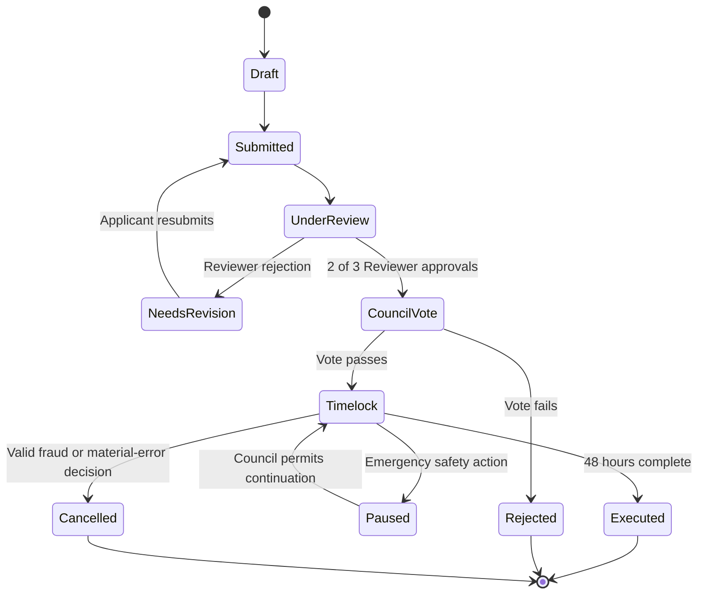

# Community Grant DAO — Functional Requirements

**Status:** Agreed product baseline  
**Purpose:** Define how the Community Grant DAO works before technical architecture and implementation are designed.

## 1. Product Overview

The Community Grant DAO is an open-domain community treasury. It funds real-world initiatives without limiting submissions to one subject such as technology, environment, or education.

Anyone can submit a funding request. Verified DAO members decide whether community funds should be spent. Elected Reviewers validate that proposals contain sufficient, genuine evidence before a funding vote begins.

The initial product is deliberately small:

- A grant has one recipient wallet and one payment amount.
- A successful grant results in one treasury transfer.
- Proposal evidence and review occur before the Council vote.
- There are no milestone payments, delegated voting, token trading, or automatic reputation algorithm in version 1.

### Product statement

> A community grant DAO where anyone can request funding for a real-world initiative, while verified members use capped, contribution-aware voting to decide whether a transparent community treasury should fund it.

## 2. Objectives

1. Let the public submit legitimate grant requests.
2. Prevent a single administrator, wealthy contributor, or fake-wallet group from controlling treasury decisions.
3. Give the community enough information to make a funding decision.
4. Keep the route from submission to payment easy to understand and audit.
5. Make each approved payment traceable to a proposal, review decision, Council vote, delay period, and on-chain transfer.

## 3. Scope

### Included in version 1

- Public grant submission
- Proposal categories used only for discovery and reporting
- Proposal evidence and Reviewer screening
- Verified Council membership and admission process
- Capped voting weight from 1 to 3
- Council funding votes with quorum
- Admin Multisig configuration management
- A 48-hour payment delay after approval
- One-time treasury transfers
- Transparent history of proposals, reviews, votes, configuration changes, and transfers

### Deferred from version 1

- Milestone-based funding and post-payment milestone reviews
- Token issuance, token markets, and token-based voting
- Delegated voting
- Category-specific Reviewer assignment
- Complex reputation scoring or prediction of vote quality
- Formal appeal court or arbitration system
- Automated recovery of funds after a completed transfer

## 4. Roles and Separation of Authority

| Role | Who can hold it | Main responsibility | Cannot do alone |
|---|---|---|---|
| Public Participant | Any wallet user | Submit a grant request and view public DAO activity | Vote, review, transfer funds, or change settings |
| Grant Applicant | A Public Participant who submits a proposal | Provide proposal details, recipient wallet, and evidence | Approve or vote on their own proposal |
| Eligible Council Member | A verified, admitted DAO member | Vote on grants, membership, Reviewer elections, and protected governance actions | Transfer treasury funds or change settings alone |
| Reviewer | An elected Eligible Council Member serving a fixed term | Check proposal completeness and evidence before Council voting | Approve treasury spending or review a conflicted proposal alone |
| Admin Multisig Signer | One of five independently selected DAO members | Apply approved changes, manage permitted configuration, and perform time-limited emergency safety actions | Approve a grant, admit/remove a member, or transfer treasury funds alone |
| Treasury | DAO-controlled account or contract | Holds funds and executes approved one-time payments | Make discretionary payments |

### Core principle

Reviewers verify whether a proposal is ready for the community to consider. Council Members decide whether money should be spent. The Admin Multisig operates safeguards and configuration. The treasury follows approved rules.

## 5. Launch and Decentralization Path

A DAO must begin with a small group that deploys the system. The launch process limits that initial power and makes it visible.

1. The DAO publishes this functional policy and its initial configuration.
2. Five independent people become the first Admin Multisig Signers.
3. A transparent founding cohort becomes the initial set of Eligible Council Members.
4. Each founding wallet and role is public in the DAO interface and on-chain records where applicable.
5. The Council can later elect, replace, or remove Admin Multisig Signers through protected governance.

The founding group has no permanent right to control the DAO. Its authority is limited by the same rules that apply later.

## 6. Membership Management

### 6.1 Membership levels

| Level | Eligibility | Rights |
|---|---|---|
| Public Participant | Connect a wallet and create a basic profile | Submit proposals and read public activity |
| Eligible Council Member | Complete verification and pass community admission | Vote and stand for Reviewer or Admin Signer roles |
| Reviewer | Be elected from Eligible Council Members | Participate in assigned evidence-review panels |

Creating a wallet profile does not create governance rights.

### 6.2 Admission as an Eligible Council Member

1. A Public Participant provides a wallet profile and completes basic identity and uniqueness verification.
2. The applicant obtains public endorsements from two Eligible Council Members.
3. The membership application becomes visible to the Council with its verification result and endorsements. Private identity documents are never made public.
4. Eligible Council Members vote using the normal simple-majority and 30% quorum rule.
5. If the vote passes, the Admin Multisig records the approved membership through the DAO's approved execution path.
6. The new member can participate only in votes that start after membership is active.

This process gives the community control over admission while requiring a basic defence against duplicate or fake identities.

### 6.3 Membership removal and emergency suspension

Removal has a higher threshold than admission because it can take away governance rights.

- A removal request must state the policy breach and supporting evidence.
- The member receives a reasonable opportunity to respond before voting closes.
- Removal requires at least two-thirds of votes cast in favour and the normal 30% quorum.
- After approval, the Admin Multisig executes the removal through the approved DAO path.
- The Admin Multisig cannot remove a member solely by its own decision.

For an immediate threat, such as a proven compromised wallet or credible fraud evidence, at least 3 of 5 Admin Signers may impose an emergency suspension for up to seven days. During suspension, the wallet cannot vote, review, or receive a new role. A Council decision is required to extend the restriction or make it permanent.

Membership changes never alter eligibility or voting weight for a vote that has already started. Each vote uses its own snapshot.

## 7. Admin Multisig

### 7.1 Composition

- The Admin Multisig has five Signers.
- Any protected Admin action requires at least 3 of 5 signatures.
- Signers should be independent people; no single person should control several signer wallets.
- A Signer remains an Eligible Council Member but receives no extra voting weight merely for being an Admin.

### 7.2 Duties

The Admin Multisig may:

- Apply future-facing configuration values, such as vote duration, quorum, timelock duration, contribution thresholds, and Reviewer term length.
- Record Council-approved membership changes.
- Publish configuration-change records.
- Trigger a limited emergency pause or suspension under the rules in this document.

### 7.3 Limits

The Admin Multisig may not:

- Approve, reject, amend, or pay a grant by itself.
- Admit or remove a Council Member without the required Council decision.
- Change the terms of a grant whose vote has already begun.
- Change the recipient wallet or amount of an approved grant.
- Give a Signer additional voting weight.

### 7.4 Signer changes

The Council elects, replaces, or removes Admin Signers through a protected governance decision requiring two-thirds approval and the normal quorum. The technical design must ensure that an outgoing Signer cannot block a valid Council-approved replacement.

## 8. Reviewer System

### 8.1 Election and term

- Any Eligible Council Member may apply or be nominated to become a Reviewer.
- Candidates publish a short profile describing relevant experience and conflicts of interest.
- The Council elects Reviewers using simple majority and the normal quorum.
- A Reviewer serves a six-month term. The term length is future-facing configuration managed by the Admin Multisig.
- The Council may remove a Reviewer before the term ends using the same two-thirds rule used for member removal.

### 8.2 Review panels

- Each submitted grant is assigned to three available Reviewers.
- Assignment should be random from the available Reviewer pool in version 1. The DAO does not attempt specialist matching.
- At least 2 of 3 Reviewers must approve the proposal before it proceeds to the Council.
- Every Reviewer records an approval or rejection reason.
- The public can see review outcomes and non-sensitive evidence references.

### 8.3 Conflicts of interest

A Reviewer must decline an assignment if they are the applicant, recipient, contributor to the proposal, a close associate of the applicant, or otherwise have a material personal interest in the outcome.

A conflicted Reviewer is replaced before the panel makes its decision. A Reviewer assigned to a grant does not vote on that grant as a Council Member. These rules prevent one person from influencing the same grant twice.

## 9. Voting Power

Every Eligible Council Member starts with one vote. A member can receive up to two additional points, so no member has more than three voting-weight points.

| Source | Weight | Intent |
|---|---:|---|
| Verified Council membership | 1 | Gives every admitted member a governance voice |
| Recognized community contribution | +1 | Rewards accepted Reviewer work or other recorded DAO contribution |
| Verified treasury contribution | +1 | Encourages support for the treasury without giving wealth unlimited power |
| Maximum | 3 | Keeps influence capped |

The detailed evidence needed for a contribution bonus is published as a future-facing configuration. A vote that matches the majority result does not earn voting weight; members must be free to vote honestly, including when they are in the minority.

Voting eligibility, each member's weight, and the quorum denominator are frozen when a vote starts. New memberships, removals, donations, and contribution changes affect only future votes.

## 10. Grant Proposal Requirements

### 10.1 Open submission

Any Public Participant may submit a grant proposal. The DAO accepts proposals from any lawful category. Categories help the community find and report on proposals; they do not limit eligibility.

To control spam while retaining open access, one wallet may have only one active proposal at a time. The platform may also apply basic off-chain rate limits.

### 10.2 Required proposal information

Each proposal must include:

- Clear title and plain-language summary
- Category
- Problem or purpose being addressed
- Requested amount
- Recipient wallet that will receive the payment
- Expected use of funds
- Applicant profile and relationship to the recipient, if different
- Supporting evidence, links, documents, or references
- Known risks and conflicts of interest

The applicant may revise and resubmit a proposal that fails Reviewer screening. Version 1 has no separate formal appeal process.

### 10.3 Evidence and privacy

Proposal summaries, requested amount, recipient wallet, review outcome, vote result, and payment record are public.

Identity records and sensitive supporting documents remain off-chain in protected storage. The public record may contain a reference, hash, or summary that proves which evidence set was reviewed without exposing private information.

## 11. Grant Lifecycle

### 11.1 Submission and review

1. An applicant creates and submits a proposal.
2. The proposal enters Reviewer screening.
3. A panel of three Reviewers checks completeness, credibility, evidence, recipient information, and declared conflicts.
4. Two approval decisions move it to a Council Vote.
5. A failed screen gives public reasons and moves the proposal to Needs Revision.

Reviewers assess whether the proposal is ready for governance; they do not decide whether treasury funds should be spent.

### 11.2 Council vote

1. The DAO creates a snapshot of eligible Council Members, voting weights, quorum denominator, vote duration, requested amount, recipient wallet, and timelock duration.
2. Council Members vote **For** or **Against** during the configured vote period. The initial default is seven calendar days.
3. At least 30% of the snapshot voting weight must participate.
4. The proposal passes when For weight is greater than Against weight.
5. A rejected vote closes the proposal with its result and cannot transfer funds.

The Admin Multisig can update the vote duration and quorum for proposals created later. It cannot alter a live vote or its snapshot.

### 11.3 Timelock and payment

1. A successful vote enters a mandatory 48-hour timelock.
2. During the timelock, the grant terms are fixed: recipient wallet, amount, vote outcome, and delay period.
3. When the timelock ends, the treasury executes one transfer of the exact approved amount to the approved recipient wallet.
4. The transfer transaction is recorded against the proposal and shown publicly.

The initial timelock is 48 hours. The Admin Multisig may change this setting for future proposals using 3 of 5 signatures.

### 11.4 Reports before payment

If credible fraud, a compromised recipient wallet, or a material error is reported before execution, the Admin Multisig may pause execution for up to seven days. The Council then decides whether to resume or cancel the grant.

Once a blockchain transfer completes, it cannot be automatically recalled. Version 1 therefore focuses its strongest verification and safety controls before payment.

## 12. Governance Actions Beyond Grants

The DAO uses the following action types.

| Action | Decision rule | Execution |
|---|---|---|
| Approve a grant | Simple majority and 30% quorum | Treasury after timelock |
| Admit a Council Member | Simple majority and 30% quorum | DAO-approved membership path |
| Elect a Reviewer | Simple majority and 30% quorum | Role becomes active for future assignments |
| Remove a Member or Reviewer | Two-thirds approval and 30% quorum | DAO-approved removal path |
| Add, remove, or replace Admin Signer | Two-thirds approval and 30% quorum | Protected governance execution |
| Emergency pause or short suspension | 3 of 5 Admin Signers, maximum seven days | Council review required for extension or cancellation |
| Update future configuration | 3 of 5 Admin Signers | Recorded change, effective only for future flows |

## 13. Configuration Rules

The Admin Multisig manages configuration only through 3 of 5 signatures. Every change must be visible in a configuration history.

Configurable values include:

- Vote duration
- Quorum percentage
- Timelock duration
- Contributor-bonus evidence and threshold
- Reviewer term length
- Proposal rate-limit settings
- Basic verification provider or process

Configuration changes are never retroactive. A grant, membership vote, or role election keeps the values that existed when its vote started.

## 14. Transparency and Audit Requirements

The product must make the following information available in a readable public history:

- Proposal details and status changes
- Reviewer assignments, decisions, and stated reasons
- Conflict-of-interest declarations
- Council vote outcomes, quorum outcome, and snapshot time
- Approved recipient wallet and exact amount
- Timelock start and completion time
- Treasury payment transaction
- Member and role changes
- Admin Multisig configuration changes and signatures
- Emergency pause or suspension reason and outcome

Sensitive personal documents are excluded from the public record.

## 15. Functional Rules and Acceptance Criteria

1. A public wallet can submit one active grant request without becoming a Council Member.
2. A proposal cannot reach the Council Vote state until at least 2 of its 3 Reviewers approve it.
3. A Reviewer cannot review or vote on a proposal in which they have a material conflict.
4. A grant cannot pass without 30% of its snapshot voting weight participating and For weight exceeding Against weight.
5. No wallet has voting weight above 3.
6. New members and changed voting weights cannot affect an ongoing vote.
7. A passed grant cannot transfer funds until its 48-hour timelock has completed.
8. The treasury can transfer only the approved amount to the approved recipient wallet.
9. A single Admin Signer cannot perform a protected administrative action.
10. The Admin Multisig cannot unilaterally admit or remove an Eligible Council Member.
11. Every completed transfer is linked to its proposal, review outcome, vote result, and timelock record.
12. Private identity documents are not stored in the public blockchain record.

## 16. Decisions Reserved for Technical Design

This document defines product behaviour. The technical requirements document will decide how to implement it, including:

- Blockchain network and testnet choice
- Smart-contract composition, governance framework, and multisig integration
- Snapshot and capped voting-weight implementation
- Wallet connection and identity-verification integration
- Off-chain database, document storage, indexing, and audit-log design
- Reviewer assignment implementation
- Frontend pages, API boundaries, and background services
- Testing, security review, monitoring, and deployment process

